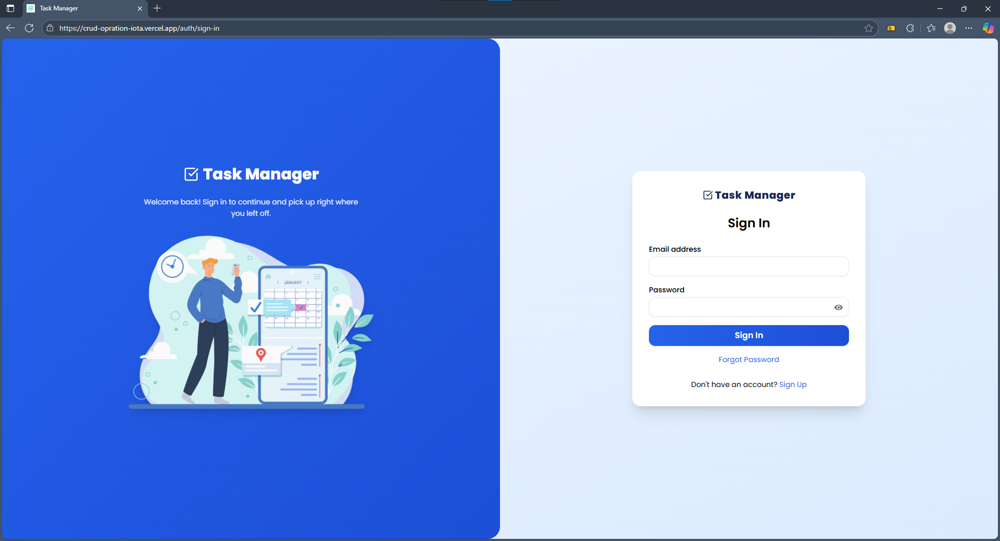
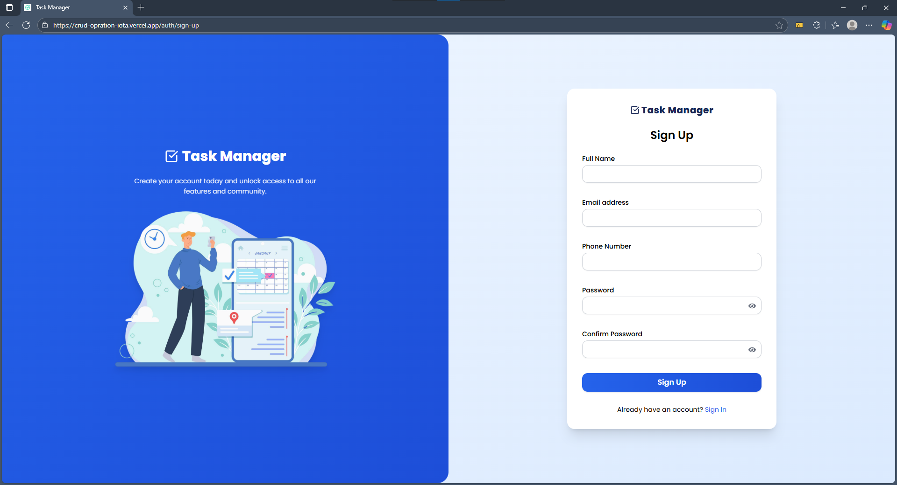
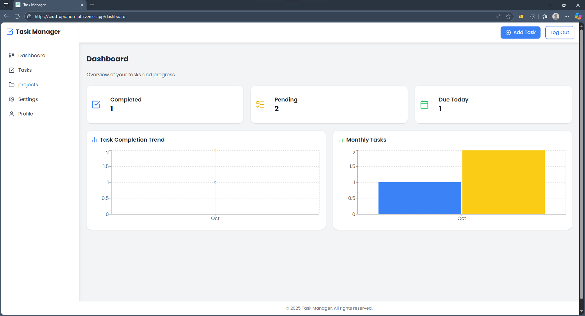
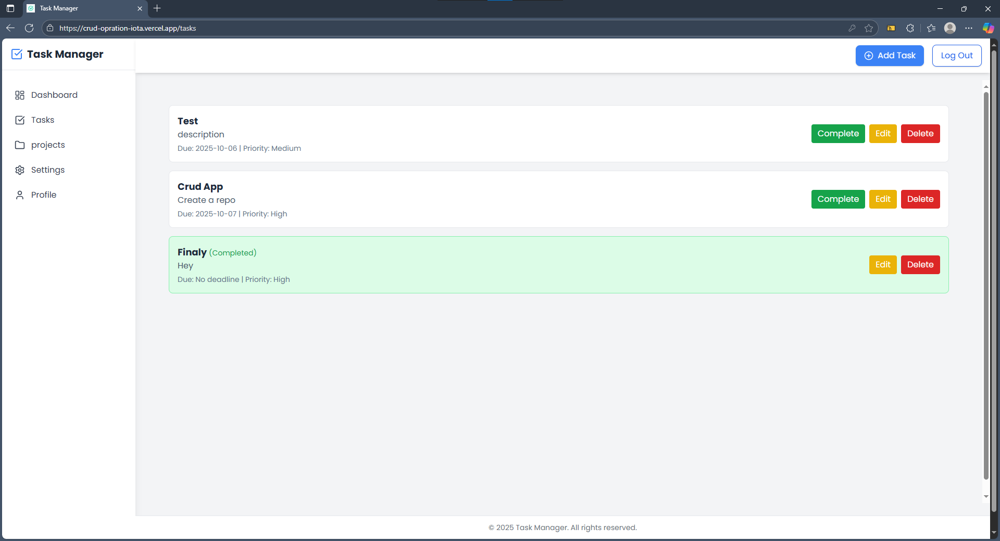
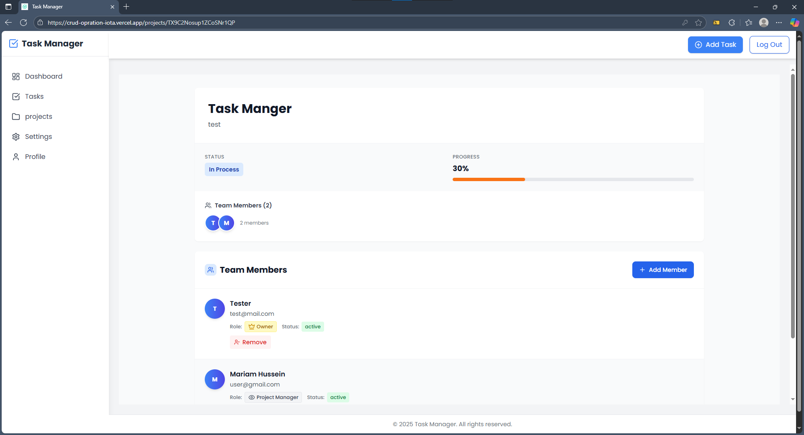
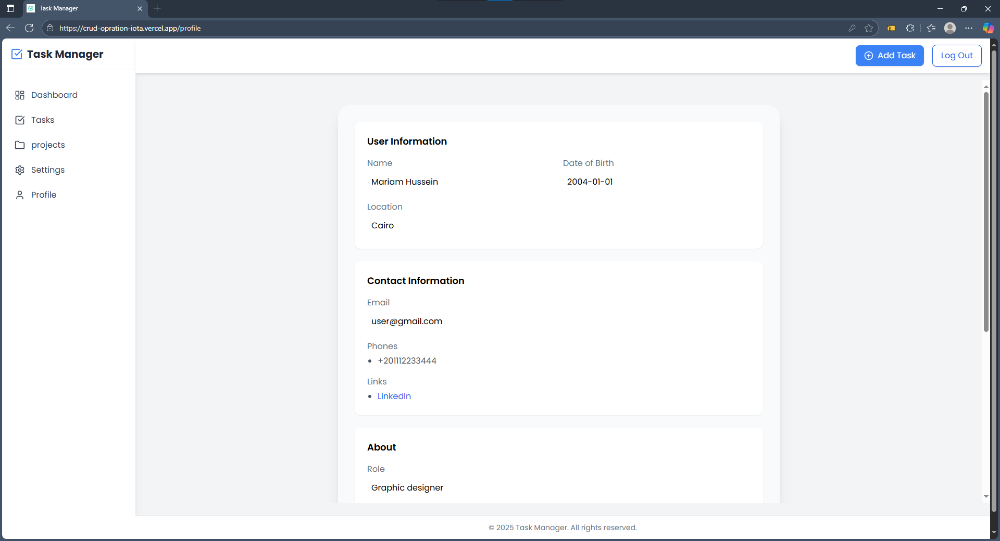
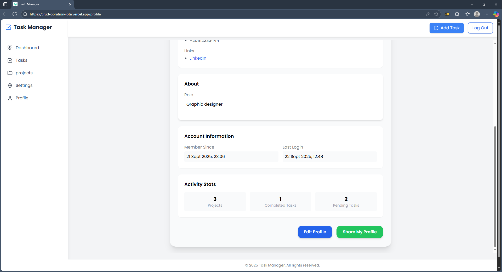

# Task Manager Web App

A collaborative project built during our internship at **DevWave** — a task and project management web app with full CRUD functionality and Firebase authentication.

---

## 🚀 Overview
This project is designed to manage **tasks and projects** efficiently.  
Users can **sign in**, manage their **personal dashboard**, create or join **projects**, and collaborate seamlessly.

---

## 🛠️ Tech Stack
- ⚛️ **React + Vite**
- 🎨 **Tailwind CSS**
- 🔥 **Firebase Authentication & Firestore**
- 🧭 **React Router**
- 🧩 **Context API / Redux (for state management)**

---

## 🔐 Features

### 🔸 Authentication
- Login / Register using **Firebase Auth**
- Secure session management

### 📊 Dashboard
- Personalized view of your tasks and stats
- Quick access to task lists and projects

### ✅ Tasks Management (CRUD)
- Add, edit, delete, and mark tasks as completed
- Real-time updates and clean UI with Tailwind

### 📁 Projects
- Create, Update, delete projects
- Send **invitations** to other users to collaborate
- Search and sort projects easily

### 👤 Profile
- View and update user info
- See task & project statistics
- Share your profile link publicly for others to join the platform

---

## 🤝 Team & Collaboration
Developed by our team during our internship at **DevWave**  

---

## 🧠 Lessons Learned
- Real-world teamwork with version control  
- Firebase integration and authentication  
- Managing multiple pages and states in React  
- Building responsive and functional dashboards

---

## 📸 Preview

Here’s a quick look at the main pages of our CRUD Operation App 👇

### 🔐 Sign in / Sign up Pages

  
  

### 🏠 Dashboard

  

### ✅ Tasks Management

  

### 📁 Projects

  

### 📁 Project Details

  

### 👤 Profile

  
  

## Live Demo
🔗 [View Website](https://crud-opration-iota.vercel.app/)